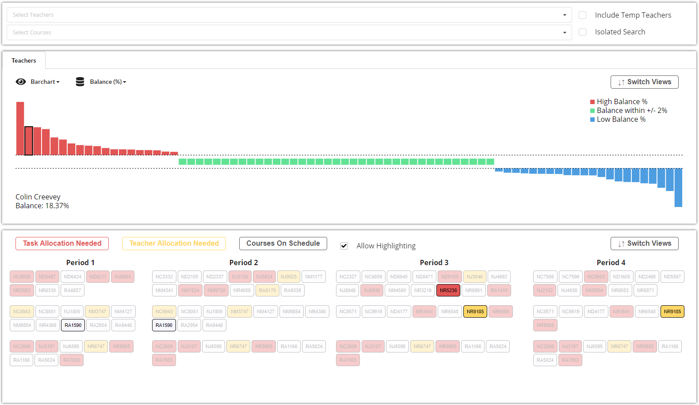
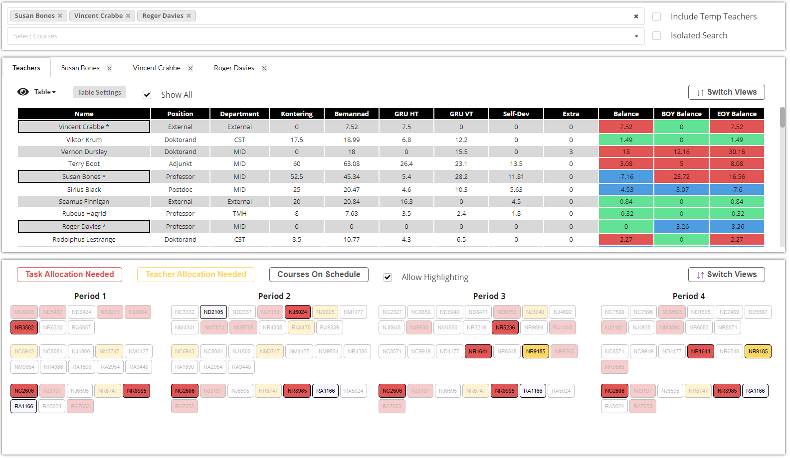
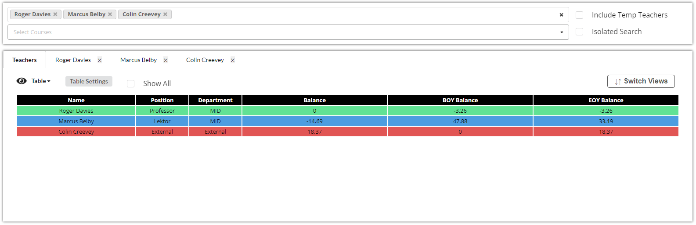
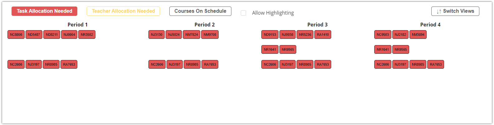
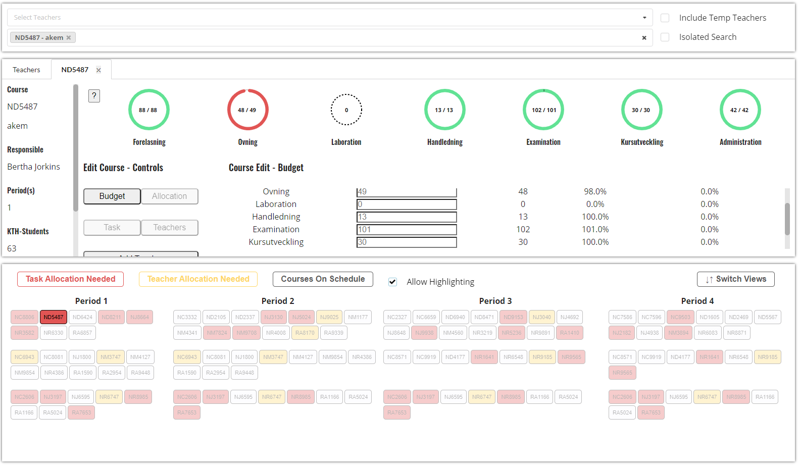

# Project
[Link to running site](https://workviz.web.app)

## Setup
To run the project:

```bash
$ git clone https://github.com/arnar44/workviz.git
```

Change diretory to the cloned repository:

```bash
$ cd workviz
```

Install packages using yarn or npm

```bash
$ npm install
```

```bash
$ yarn install
```

Run project

```bash
$ npm run start
```

```bash
$ yarn run start
```

Since the project was supposed to be a tool originally where data could be changed, the data is dished from firebase. You will need to create a config file 'src/Config.js' containing the firebase config if you wish to do the same or the app can be changed to read the data from 'public/anonMerged.json' directly. 

# Workviz - Information Visualization
This project was originally made for [DH2321 _Information Visualization_](https://www.kth.se/student/kurser/kurs/DH2321) course at KTH as a final group project.

[Link to the original code repository](https://github.com/arda460/workviz)

[Link to the original project running](https://work-vis.firebaseapp.com/)

In the original running project, under "About the Project", each team members contribution are listed as well as the motivations and goals for the project. 

Most of the team was included in examining the data, what was important and what wasn't, and working together to come up with visual mappings and designs. Most of what ended up being done was prototyped which made for easier development.

The original data was stored in an disorganized spreadsheet, so, in the beginning of the project I wrote a few python scripts to parse the data to json format and anonymize the data. After that I spent most of my time developing the front-end along with [Alexander](https://github.com/LxMat).

## Motivation for the original project
The director of studies at the MEdia Technology department proposed the project, where he wanted to see if the spreadsheet he worked on to organize classes, budgets, teachers working hourse could be visualized into something easier to work with.

Ideally he wanted a tool where he could interact with the data and indetify problem areas, but that was outside the scope of the course and the goal of the project was only to visualize the data. 

## Motivation for this project
I had three main motivations to do this project. 
1. I wanted the practice. The front-end work for the original assignment was split between me and Alexander, but I wanted to try and do the parts of the site I had not worked on, like making the 'barchart' and experiment further with D3.
2. Like with many school projects, it was mostly finished but not completely, there where still a few aspects that we had not had much time to work on that I wanted to fix just for the fun of it. The structure of the project was not ideal since we did not exactly know what we were going to do in the beginning of the project, so that in combination with 'Reason no 1' pushed me to start over in stead of continuing where we left of.
3. Originally the director of studies had expressed interest in getting a tool instead of a data visualization, when it was decided that, that was not within the scope of the project, he suggested collaborating again in the following summer to turn the visualization into a tool. At the time I wanted a hoppy assignment and was willing to continue working on the project for fun but also had in mind that what I would do might be later used to develop the tool.

## Current state of project
The idea of the tool was scrapped and I became busy with other projects, so the status of the current project is far from complete. 

Most of the overview has been completed. But the detail view for teachers has not been implemented and the detail view for courses has been done to some extent but is far from being completed. 

## Data
The data consists of teacher data and course data.

The data as been anonymized, with teachers getting random names from Harry Potter and the courses getting random course codes and 'Short names'

### Teacher data
Each teacher object contains a variety of information about the teacher such as his/her position and department and so on. But the most important for this project was the 'Balance'. Balance indicates the if a teacher is not working enough or working to much with respect to how much work he/she was hired to do. A high balance (red) will indicate a teacher working to much, good balance (green) indicates that the teacher is working the right amount (within +/- 2%) and low balance (blue) will indicate a teacher not working enough. 

Similarly there is Beginning-of-year-balance which tells us how the teacher ended the previous year, and the end-of-year-balance which is a projection on how the teacher will end the current year. 

The teacher data can be viewed in a 'barchart' or 'table'. Switching between views can be done by clicking the 'eye' icon in the top left corner of the teacher part of the site. 

#### Barchart
 The barchart can be set to visualize the balance, the EOY-balance or BOY-balance depending on the task in hand. 

 Hovering over a teacher will show his name and the value of the variable being visualized in the barchart. It will also highlight the courses that the teacher is involved in. 

 


 Clicking on a teacher in the barchart will 'select' him, and he can be seen on the top of the site, like he had been searched for, and a new tab will open with more information about the teacher (TODO: Currently it only displays the teachers name). When a teacher is selected, the courses he is involved in will be permanently highlighted unless "Allow highlighting" is disabled. When a teacher/course is selected, other courses/teachers can still be hovered over which will highlight the correct data while the hover takes place, before going back to the 'selected' highlighting. 

 
 #### Table 
 When the data is viewed in a table a veriety of settings and filters can be applied, for example change color coding, remove data from visualization or filtering on any of the columns. The data can also be sorted by any of the columns by clicking the column name.

 The same unctionality as in the barchart can be used. When hovering a teacher in the table or clicking a tacher the same thing will happen as with the barchart. 

 If 'Show All' is disabled, if a teacher or course is selected, the table will just contain that selected data. Otherwise it will contain all the data but the selected items will be highlighted with a border and an astrict at the end of the teacher name. 

 Example of table with 3 selected teachers and the 'Show All' feature enabled.

  

  Example of table with 3 selected teachers. 'Show all' is disabled, and color coding has been changed and columns removed in 'Table settings'

  

### Course data
The courses are simply listed out. There are 4 columns, each representing the perios in which the course will take place. There are also 3 rows. The top row includes courses that only take place in a single period, row 2 includes courses that take place over 2 perios and the 3 row includes courses that take place over all 4 periods.

Courses can be filtered after status (color) by pressing the red, yellow and gray buttons. 

  

  Red indicates that 'task allocation is needed' which means that certain tasks within a course have been budgeted but no work has been allocated to the course.

  Yellow indicates that 'Teacher allocation is needed' which means that certain tasks have been budgeted and allocated but no teachers have been assigned to the course. 

  Gray indicates that 'Course is on schedule' which means it has been budgeted and allocated and teachers assigned to it. 

  Hovering on a course will highlight the teachers in that course in the table/barchart depending on what is being displayed. 

  Clicking a course will also 'select' that course, much like when a teacher is selected. A tab will open up displaying some more information and visualization of the course data, this is where development was stoppend, so it still needs some work, but some of the data is at display. 

    

  More information about the progress bars can be accessed by hovering over the question mark in the top left corner.

  When a tab is opened like in the above picture, it might be useful to still have the course/teacher overview open. In the above photo, the course overview is being displayed but it can be switched to the teacher overview (barchart/table) by clicking 'Switch Views' in the top right corner of the course overview. 

  ## Final
  Regarding the searchbars on top of the site. Searchin and then selecting a teacher will highlight both the teacher and the courses that the teacher is involved in (and vice versa when courses are searched selected). This can be changed by enabling 'Isolated Search' which will link the search only with the overview that was searched.  

  In the data there are a few 'temp' teachers that represent TA's, external teachers and so on, these teachers are not include by default but can be by enabling 'Include Temp Teachers'

  This covers most of the functionality of the site but there might still be some features that where forgotten to mention. 


